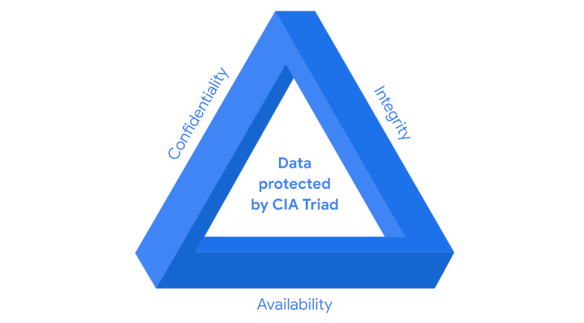

# FOUNDATIONS OF CYBERSECURITY

Security analysts are responsible for monitoring and protecting information and systems. 
1. protecting computer and network systems.
2. install prevention software for the purposes of identifying risks and vulnerabilities.
3. conducting periodic security audits.

| **Term** | **Definition** |
| - | - |
| **Playbook**                                             | A list outlining how to go through a specific detection and what the analyst needs to review to investigate those incidents.|
| **Compliance**                                           | The process of adhering to internal standards and external regulations to help organizations avoid fines and security breaches.|
| **Security Frameworks**                                  | Guidelines used to build plans that mitigate risks and threats to data and privacy.|
| **Security Controls**                                    | Safeguards designed to reduce specific security risks. Used alongside security frameworks to establish a strong security posture.|
| **Security Posture**                                     | An organization’s ability to manage its defense of critical assets and data and respond to changes. A strong security posture lowers organizational risk.|
| **Threat Actor / Malicious Attacker**                    | Any person or group posing a security risk to computers, applications, networks, or data.|
| **Internal Threat**                                      | A current or former employee, external vendor, or trusted partner who poses a security risk. Can be **accidental** ( ie. clicking a malicious link) or **intentional** ( ie. unauthorized data access).|
| **Network Security**                                     | The practice of protecting an organization’s network infrastructure data, services, systems, and devices from unauthorized access.|
| **Cloud Security**                                       | Ensures assets stored in the cloud are properly configured and accessible only to authorized users. Focuses on protecting data, applications, and infrastructure hosted in remote data centers via the internet.|
| **Programming**                                          | The process of creating specific instructions for a computer to execute tasks such as: <ul><li>Automating repetitive tasks ( ie. searching malicious domains)</li><li>Reviewing web traffic</li><li>Alerting on suspicious activity</li></ul>|
| **Personally Identifiable Information (PII)**            | Any information that can infer an individual's identity ( ie. full name, date of birth, address, phone number, email, IP address, etc.).|
| **Sensitive Personally Identifiable Information (SPII)** | A stricter type of PII that includes data requiring greater protection, such as social security numbers, medical or financial information, and biometric data ( ie. facial recognition).|

Keeping Organizations Secure :
- Analytical Thinking, think carefully and thoroughly when monitoring and securing computer and network systems.
- Collaboration working with stakeholders and other team members when responding to an active threat.
- Malware prevention, installing prevention software.
- Communication, document and report findings.
- Understanding programming languages.
- Using SIEM tools, when conducting a periodic security audit to better understand security threats, risks, and vulnerabilities.

---

**PHISHING**

Phishing is the use of digital communications to trick people into revealing sensitive data or deploying malicious software.\
Some of the most common types of phishing attacks today include: 

- **Business Email Compromise (BEC)** : A threat actor sends an email message that seems to be from a known source to make a seemingly legitimate request for information, in order to obtain a financial advantage.
- **Spear phishing** : A malicious email attack that targets a specific user or group of users. The email seems to originate from a trusted source.
- **Whaling** : A form of spear phishing. Threat actors target company executives to gain access to sensitive data.
- **Vishing** : The exploitation of electronic voice communication to obtain sensitive information or to impersonate a known source.
- **Smishing** : The use of text messages to trick users, in order to obtain sensitive information or to impersonate a known source.

---

**MALWARE**

Malware is software designed to harm devices or networks. There are many types of malware. The primary purpose of malware is to obtain money, or in some cases, an intelligence advantage that can be used against a person, an organization, or a territory.\
Some of the most common types of malware attacks today include: 

- **Viruses** : Malicious code written to interfere with computer operations and cause damage to data and software. A virus needs to be initiated by a user (i.e., a threat actor), who transmits the virus via a malicious attachment or file download. When someone opens the malicious attachment or download, the virus hides itself in other files in the now infected system. When the infected files are opened, it allows the virus to insert its own code to damage and/or destroy data in the system.
- **Worms** : Malware that can duplicate and spread itself across systems on its own. In contrast to a virus, a worm does not need to be downloaded by a user. Instead, it self-replicates and spreads from an already infected computer to other devices on the same network.
- **Ransomware** : A malicious attack where threat actors encrypt an organization's data and demand payment to restore access. 
- **Spyware** : Malware that’s used to gather and sell information without consent. Spyware can be used to access devices. This allows threat actors to collect personal data, such as private emails, texts, voice and image recordings, and locations.

---

**SOCIAL ENGINEERING**

Social engineering is a manipulation technique that exploits human error to gain private information, access, or valuables. Human error is usually a result of trusting someone without question. It’s the mission of a threat actor, acting as a social engineer, to create an environment of false trust and lies to exploit as many people as possible.\
Some of the most common types of social engineering attacks today include:

- **Social media phishing** : A threat actor collects detailed information about their target from social media sites. Then, they initiate an attack.
- **Watering hole attack** : A threat actor attacks a website frequently visited by a specific group of users.
- **USB baiting** : A threat actor strategically leaves a malware USB stick for an employee to find and install, to unknowingly infect a network. 
- **Physical social engineering** : A threat actor impersonates an employee, customer, or vendor to obtain unauthorized access to a physical location.

**Social Engineering Principles** 

Social engineering is incredibly effective. This is because people are generally trusting and conditioned to respect authority. The number of social engineering attacks is increasing with every new social media application that allows public access to people's data. Although sharing personal data such as your location or photos can be convenient, it’s also a risk.\
Reasons why social engineering attacks are effective include:

- **Authority** : Threat actors impersonate individuals with power. This is because people, in general, have been conditioned to respect and follow authority figures. 
- **Intimidation** : Threat actors use bullying tactics. This includes persuading and intimidating victims into doing what they’re told. 
- **Consensus/Social proof** : Because people sometimes do things that they believe many others are doing, threat actors use others’ trust to pretend they are legitimate. For example, a threat actor might try to gain access to private data by telling an employee that other people at the company have given them access to that data in the past. 
- **Scarcity** : A tactic used to imply that goods or services are in limited supply. 
- **Familiarity** : Threat actors establish a fake emotional connection with users that can be exploited.  
- **Trust** : Threat actors establish an emotional relationship with users that can be exploited over time. They use this relationship to develop trust and gain personal information.
- **Urgency** : A threat actor persuades others to respond quickly and without questioning.

---

The **CISSP** (Certified Information Systems Security Professional) certification, governed by **(ISC)²**, is structured around eight domains that together make up the CISSP Common Body of Knowledge (**CBK**).

| **Domain** | **Description** |
| - | - |
| **1. Security and Risk Management**          | Covers confidentiality, integrity, and availability (CIA triad), governance, compliance, legal issues, risk management, and professional ethics.|
| **2. Asset Security**                        | Focuses on protecting organizational assets, including classification, ownership, privacy, and data lifecycle management.|
| **3. Security Architecture and Engineering** | Deals with designing and implementing secure systems, security models, cryptography, hardware and software security, and physical security.|
| **4. Communication and Network Security**    | Covers network architecture, secure communication channels, network attacks, and network access control.|
| **5. Identity and Access Management (IAM)**  | Focuses on identification, authentication, authorization, identity federation, and access control mechanisms.|
| **6. Security Assessment and Testing**       | Involves designing, performing, and analyzing security testing and audits to ensure systems meet security standards.|
| **7. Security Operations**                   | Deals with incident response, disaster recovery, logging, monitoring, resource protection, and change management.|
| **8. Software Development Security**         | Focuses on integrating security throughout the software development lifecycle (SDLC), including secure coding practices and application testing.|

---

**TYPES OF ATTACKS**

**--> Password Attack ( communication and network security domain )**

A password attack is an attempt to access password-secured devices, systems, networks, or data.
- Brute force
- Rainbow table

**--> Social Engineering Attack ( security and risk management domain )**

Social engineering is a manipulation technique that exploits human error to gain private information, access, or valuables.
- Phishing
- Smishing
- Vishing
- Spear phishing
- Whaling
- Social media phishing
- Business Email Compromise (BEC)
- Watering hole attack
- USB (Universal Serial Bus) baiting
- Physical social engineering 

**--> Physical Attack ( asset security domain )**

A physical attack is a security incident that affects not only digital but also physical environments where the incident is deployed.
- Malicious USB cable
- Malicious flash drive
- Card cloning and skimming
 
**--> Adversarial Artificial Intelligence ( communication and network security and the identity and access management domains )**

Adversarial artificial intelligence is a technique that manipulates artificial intelligence and machine learning technology to conduct attacks more efficiently. 

**--> Supply-Chain Attack ( security and risk management, security architecture and engineering, security operations domains, etc... )**

A supply-chain attack targets systems, applications, hardware, software supply chains to locate a vulnerable point to alter the product. 

**--> Cryptographic Attack ( communication and network security domain )**

A cryptographic attack affects secure forms of communication between a sender and intended recipient.
- Birthday
- Collision
- Downgrade

---

**TYPES OF THREAT ACTORS**

**--> Advanced Persistent Threats**

Advanced persistent threats (APTs) have significant expertise accessing an organization's network without authorization. APTs tend to research their targets ( ie. large corporations or government entities)  in advance and can remain undetected for an extended period of time. Their intentions and motivations can include:
- Damaging critical infrastructure, such as the power grid and natural resources
- Gaining access to intellectual property, such as trade secrets or patents

**--> Insider Threats**

Insider threats abuse their authorized access to obtain data that may harm an organization. Their intentions and motivations can include: 
- Sabotage
- Corruption
- Espionage
- Unauthorized data access or leaks 

**--> Hacktivists**

Hacktivists are threat actors that are driven by a political agenda. They abuse digital technology to accomplish their goals, which may include: 
- Demonstrations
- Propaganda
- Social change campaigns
- Fame

---

**HACKERS**

A hacker is any person who uses computers to gain access to computer systems, networks, or data with or without consent.
- **Authorized hackers** ( ethical hackers ). They follow a code of ethics and adhere to the law to conduct organizational risk evaluations.
- **Semi-authorized hackers** are considered researchers. They search for vulnerabilities but don’t take advantage of the vulnerabilities they find.
- **Unauthorized hackers** are malicious threat actors who do not follow or respect the law. Their goal is financial gain. 

---

**SECURITY FRAMEWORKS AND CONTROLS**

Security Frameworks are guidelines used for building plans to help mitigate risks and threats to data and privacy :
- Protecting personally identifiable information ( PII ).
- Securing financial information.
- Identifying security weaknesses.
- Managing organizational risks.
- Aligning security with business goals.

4 core components of security frameworks :
- Identify & Document Goals.
- Setting Guidelines.
- Implementing Strong Security Processes.
- Monitoring and Communicating Results.

**Compliance** is the process of adhering to internal standards and external regulations.

The CIA triad is a foundational cybersecurity model that helps inform how organizations consider risk when setting up systems and security policies.
- Confidentiality : only authorized users can access specific assets or data.
- Integrity : data is correct, authentic, and reliable.
- Availability : data is accessible to those who are authorized to access it.

| **Framework / Regulation**                                                                             | **Description**                                                                                                                                                                                                                                                                                                                                   |
| ------------------------------------------------------------------------------------------------------ | ------------------------------------------------------------------------------------------------------------------------------------------------------------------------------------------------------------------------------------------------------------------------------------------------------------------------------------------------- |
| **National Institute of Standards and Technology: Cybersecurity Framework (NIST-CSF)**                 | A voluntary framework providing standards, guidelines, and best practices to manage and reduce cybersecurity risk for organizations of all sizes. Focuses on five functions: Identify, Protect, Detect, Respond, and Recover.                                                                                                                     |
| **National Institute of Standards and Technology: Risk Management Framework (NIST-RMF)**               | Provides a process for integrating security, privacy, and risk management activities into the system development life cycle. Used primarily by U.S. federal agencies and contractors.                                                                                                                                                             |
| **Federal Energy Regulatory Commission – North American Electric Reliability Corporation (FERC-NERC)** | Regulation applying to organizations that work with electricity or the U.S./North American power grid. Requires preparation for, mitigation of, and reporting on any potential security incident affecting the grid. Organizations must comply with **Critical Infrastructure Protection (CIP) Reliability Standards** defined by FERC.           |
| **Federal Risk and Authorization Management Program (FedRAMP)**                                        | A U.S. federal government program that standardizes security assessment, authorization, and continuous monitoring for cloud services and products. Ensures consistent cloud security across government agencies and third-party providers.                                                                                                        |
| **Center for Internet Security (CIS)**                                                                 | A nonprofit providing a set of actionable security controls to safeguard systems and networks against attacks. Helps organizations build strong defenses and guides professionals on actions to take during security incidents.                                                                                                                   |
| **General Data Protection Regulation (GDPR)**                                                          | An E.U. regulation protecting residents’ data privacy and processing rights both inside and outside E.U. territory. Organizations must be transparent about data collection and notify affected individuals within **72 hours** of a data breach. Noncompliance can result in heavy fines.                                                        |
| **Payment Card Industry Data Security Standard (PCI DSS)**                                             | An international standard ensuring organizations that handle credit card data do so securely. Applies to storing, processing, and transmitting cardholder information, aiming to reduce credit card fraud.                                                                                                                                        |
| **Health Insurance Portability and Accountability Act (HIPAA)**                                        | A U.S. federal law (1996) that safeguards patients' health information. Prohibits sharing patient data without consent and mandates breach notifications. Governed by three key rules: **Privacy**, **Security**, and **Breach Notification**. Also tied to **HITRUST**, a framework that helps organizations meet HIPAA compliance requirements. |
| **International Organization for Standardization (ISO)**                                               | Establishes international standards for technology, manufacturing, and management. Helps organizations improve processes, efficiency, and quality across global operations.                                                                                                                                                                       |
| **System and Organization Controls (SOC 1, SOC 2)**                                                    | Developed by the **American Institute of Certified Public Accountants (AICPA)**. These auditing standards evaluate an organization’s internal controls related to user access and data security across levels such as associates, managers, executives, and vendors.                                                                              |

---

## ETHICAL PRINCIPLES

- Confidentiality - only authorized users can access specific assets or data.
- Privacy Protections - safeguarding personal information from unauthorized use.
- Laws - rules that are recognized by a community and enforced by a governing entity.

**COUNTER ATTACKS**

The International Court of Justice (ICJ), which updates its guidance regularly, states that a person or group can counterattack if: 
- The counterattack will only affect the party that attacked first.
- The counterattack is a direct communication asking the initial attacker to stop.
- The counterattack does not escalate the situation.
- The counterattack effects can be reversed.

---

| **Concept** | **Description** |
| - | - |
| **Log**                                         | A record of events that occur within an organization's systems.|
| **SIEM tool**                                   | An application that collects and analyzes log data to monitor critical activities in an organization. (**Splunk / Chronicle**)|
| **SIEM dashboards**                             | Visual interfaces within SIEM tools that organize data into categories, allowing users to select the data they want to analyze.|
| **Network protocol analyzer (packet sniffer)**  | A tool designed to capture and analyze data traffic in a network.|
| **Playbook**                                    | A manual that provides details about operational actions, such as how to respond to a security incident.|
| **Chain of custody playbook**                   | A guide documenting the process of maintaining evidence possession and control during the incident lifecycle.|
| **Protecting and preserving evidence playbook** | A guide detailing how to properly handle fragile and volatile digital evidence.|
| **Order of volatility**                         | A sequence outlining the priority for preserving data, starting with the most volatile (data that may be lost if the device powers off) to the least volatile.|

---

| **Term / Concept**                    | **Description**                                                                                                                                               |
| ------------------------------------- | ------------------------------------------------------------------------------------------------------------------------------------------------------------- |
| **Programming**                       | A process used to create a specific set of instructions for a computer to execute tasks.                                                                      |
| **Automation**                        | The use of technology to reduce human and manual effort in performing common and repetitive tasks.                                                            |
| **Database**                          | An organized collection of information or data.                                                                                                               |
| **Data point**                        | A specific piece of information.                                                                                                                              |
| **Operating system (OS)**             | The interface between computer hardware and the user.                                                                                                         |
| **Command-line interface (CLI)**      | A text-based user interface that uses commands to interact with the computer.                                                                                 |
| **Web vulnerability**                 | A unique flaw in a web application that can be exploited through malicious code or behavior, allowing unauthorized access, data theft, or malware deployment. |
| **Antivirus software**                | A program used to prevent, detect, and eliminate malware and viruses.                                                                                         |
| **Intrusion detection system (IDS)**  | An application that monitors system activity and alerts on possible intrusions.                                                                               |
| **Encryption**                        | The process of converting data from a readable format to a cryptographically encoded format.                                                                  |
| **Penetration testing (pen testing)** | A simulated attack used to identify vulnerabilities in systems, networks, websites, applications, and processes.                                              |

Example Portfolio projects
- Drafting a professional statement
- Conducting a security audit
- Analyzing network structure and security
- Using Linux commands to manage file permissions
- Applying filters to SQL queries
- Identifying vulnerabilities for a small business
- Documenting incidents with an incident handler’s journal 
- Importing and parsing a text file in a security-related scenario
- Creating or revising a resume