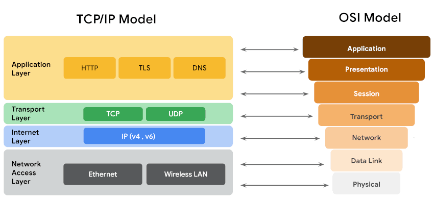
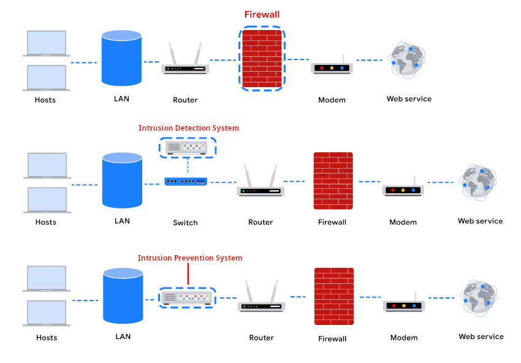

# NETWORK SECURITY

## NETWORK MODELS

## NETWORK PROTOCOLS

| **Category**                | **Protocol**                               | **Purpose / Description**                                                                        | **Port**                                   | **TCP/IP Layer** |
| --------------------------- | ------------------------------------------ | ------------------------------------------------------------------------------------------------ | ------------------------------------------ | ---------------- |
| **Communication Protocols** | TCP (Transmission Control Protocol)        | Connection-oriented protocol for reliable data transmission using a three-way handshake.         | N/A                                        | Transport        |
|                             | UDP (User Datagram Protocol)               | Connectionless protocol for fast, low-latency data transmission; less reliable than TCP.         | N/A                                        | Transport        |
|                             | HTTP (Hypertext Transfer Protocol)         | Application-layer protocol for client-server web communication; insecure.                        | 80                                         | Application      |
|                             | DNS (Domain Name System)                   | Resolves domain names to IP addresses; uses UDP, switches to TCP if responses are large.         | 53                                         | Application      |
| **Management Protocols**    | SNMP (Simple Network Management Protocol)  | Monitors and manages network devices; can change configurations or report bandwidth usage.       | N/A                                        | Application      |
|                             | ICMP (Internet Control Message Protocol)   | Reports data transmission errors and assists with troubleshooting (e.g., ping).                  | N/A                                        | Internet         |
|                             | DHCP (Dynamic Host Configuration Protocol) | Automatically assigns IP addresses and network configuration to devices on a network.            | 67 (server), 68 (client)                   | Application      |
|                             | ARP (Address Resolution Protocol)          | Resolves IP addresses to MAC addresses within a local network; no ports.                         | None                                       | Network          |
| **Security Protocols**      | HTTPS (Hypertext Transfer Protocol Secure) | Secure version of HTTP using SSL/TLS encryption to protect transmitted data.                     | 443                                        | Application      |
|                             | SFTP (Secure File Transfer Protocol)       | Secure file transfer over SSH, often used with cloud storage; encrypts data with AES and others. | 22                                         | Application      |
|                             | SSH (Secure Shell)                         | Secure remote administration and communication over a network; encrypts all transmissions.       | 22                                         | Application      |
|                             | Telnet                                     | Unencrypted protocol for remote administration and communication.                                | 23                                         | Application      |
|                             | POP3 (Post Office Protocol 3)              | Receives email from a mail server.                                                               | 110 (unencrypted), 995 (encrypted SSL/TLS) | Application      |
|                             | IMAP (Internet Message Access Protocol)    | Accesses email on a mail server while keeping it synchronized.                                   | 143 (unencrypted), 993 (encrypted SSL/TLS) | Application      |
|                             | SMTP (Simple Mail Transfer Protocol)       | Sends email messages.                                                                            | 25 (unencrypted)                           | Application      |
|                             | SMTPS (SMTP Secure)                        | Secure version of SMTP using TLS encryption.                                                     | 587 (encrypted)                            | Application      |

### IEEE 802.11 PROTOCOLS

| Protocol            | Year | Key Features                                                        | Security Improvements                              | Vulnerabilities                       | Typical Use                                          |
| ------------------- | ---- | ------------------------------------------------------------------- | -------------------------------------------------- | ------------------------------------- | ---------------------------------------------------- |
| **WEP**             | 1999 | Basic wireless encryption                                           | Provides “wired-equivalent” privacy                | Easily broken; weak keys              | Older devices, legacy networks                       |
| **WPA**             | 2003 | TKIP, larger keys, message integrity check                          | Fixes WEP encryption flaws                         | KRACK attacks possible                | Transitional measure; older hardware                 |
| **WPA2**            | 2004 | AES encryption, CCMP for integrity                                  | Strong encryption & authentication                 | Still vulnerable to KRACK             | Standard Wi-Fi security; Personal & Enterprise modes |
| **WPA2 Personal**   | 2004 | Shared passphrase                                                   | Easy home setup                                    | Passphrase can be compromised if weak | Home networks                                        |
| **WPA2 Enterprise** | 2004 | Centralized user management                                         | Individual keys for users                          | Complex setup                         | Business networks                                    |
| **WPA3**            | 2018 | SAE handshake, 128-bit (personal) / 192-bit (enterprise) encryption | Fixes WPA2 KRACK vulnerability, stronger passwords | Minimal (much harder to attack)       | Modern devices; future standard                      |

**WEP** : May still appear on legacy devices or routers with default settings.\
**WPA** : Designed as a transitional protocol to maintain backward compatibility with older hardware.\
**WPA2 Personal** : Passphrase must be applied individually to each device.\
**WPA2 Enterprise** : Allows network administrators to grant or revoke user access centrally.Users never see encryption keys, reducing the risk of key theft.\
**WPA3** : Prevents attackers from capturing data to attempt offline password cracking.

## FIREWALLS

A **firewall** is a security system that monitors and controls incoming and outgoing network traffic, allowing or blocking data based on predetermined security rules.

- **Functions**
    + Packet filtering : Inspects each data packet entering or leaving the network and allows or blocks it based on predefined rules (ie. IP addresses, protocol types).
    + Port filtering: Controls access to specific network ports, blocking or permitting traffic for particular services (like HTTP on port 80).

- **Types**
    + Hardware firewall: A physical device placed between the network and the internet, providing protection at the network perimeter.
    + Software firewall: Installed on servers or individual devices to monitor and control traffic locally.
    + Cloud-based firewall: Hosted in the cloud, filtering traffic before it reaches the network, often used for scalable or remote protection.

- **Classes**
    + Stateless firewall : Checks packets individually without considering the context of the connection; simpler but less secure.
    + Stateful firewall : Tracks the state of active connections, allowing only packets that are part of legitimate sessions; more secure but can be resource-intensive.
    + Next-Generation Firewall (NGFW) : Combines traditional firewall functions with advanced features like intrusion prevention, application awareness, and deep packet inspection.

---

A **Virtual Private Network** is a network technology that establishes an encrypted tunnel between a client device and a remote server, securing data in transit over untrusted networks

---

## SECURITY ZONES

**Security zones** are logical or physical segments with specific security policies of a network that group systems, devices, or resources based on their security requirements.

| Security Zone                   | Description                                                     | Typical Use                             | Control                 |
| ------------------------------- | --------------------------------------------------------------- | --------------------------------------- | ----------------------- |
| **Internal / Trusted Zone**     | Highly secure area within the network                           | Corporate LAN, employee devices         | Controlled              |
| **DMZ (Demilitarized Zone)**    | Semi-secured zone between internal network and external network | Public-facing servers (web, email, FTP) | Controlled              |
| **External / Untrusted Zone**   | Zone outside the organization’s control                         | Internet or public networks             | Uncontrolled            |
| **Restricted / Sensitive Zone** | Segmented area for highly critical resources                    | Financial systems, HR databases         | Controlled              |
| **Guest Zone**                  | Isolated area for temporary or visitor access                   | Wi-Fi for guests in offices or campuses | Controlled (restricted) |

---

**Subnetting** is the subdivision of a network into logical groups called subnets.\
**Classless Inter-Domain Routing (CIDR)** is a method of assigning subnet masks to IP addresses to create a subnet. 

---

## PROXY SERVER

A proxy server is an intermediary network device that intercepts client requests to and from external servers, process and forward accordingly using NAT.
Features:
- caching
- request/response filtering
- authentication
- load balancing
- traffic logging.

| Type                             | Description                                                                                | Typical Use                                           |
| -------------------------------- | ------------------------------------------------------------------------------------------ | ----------------------------------------------------- |
| **Forward Proxy**                | Sits between client and internet; forwards client requests to external servers             | Internet access control, content filtering, anonymity |
| **Reverse Proxy**                | Sits between internet and internal servers; forwards external requests to internal servers | Load balancing, caching, web application security     |
| **Transparent Proxy**            | Intercepts requests without modifying them or requiring client configuration               | Content caching, network monitoring                   |
| **Anonymous Proxy**              | Hides client IP from destination servers                                                   | Privacy and anonymity                                 |
| **High Anonymity (Elite) Proxy** | Hides both client IP and the fact that a proxy is being used                               | Maximum privacy and anti-tracking                     |
| **SOCKS Proxy**                  | Operates at network layer (TCP/UDP); forwards any type of traffic                          | P2P applications, gaming, generic TCP/UDP forwarding  |
| **Caching Proxy**                | Stores frequently accessed content to reduce latency and bandwidth                         | Improve performance for repeated requests             |

---

## VPN

**Remote access** VPNs let individual users securely connect their personal devices to a VPN server over the internet.\
**Site-to-Site** VPNs connect entire networks—often used by organizations with multiple locations.\
Site-to-site VPNs commonly rely on IPSec for encrypted tunnels but are more complex to configure than remote access VPNs.

**WireGuard** and **IPSec** are two VPN protocols used to secure network traffic.\
**WireGuard** is newer, simpler, open source, and optimized for high performance, making it ideal for fast downloads and easy deployment.\
**IPSec** is older, widely supported, and thoroughly tested, which makes it attractive for enterprises that value established security and compatibility.\
Choice between the two depends on factors like speed, infrastructure, and user needs.

---

## INTRUSIONS

**Network Interception Attacks**

- Involve intercepting network traffic to steal information or disrupt communication.

    + **Packet sniffing:** Capturing and reading data traveling across a network.
    + **On-path (Man-in-the-Middle) attack:** Intercepting and possibly altering communication between two parties.
    + **Replay attack:** Reusing captured data packets to impersonate a user or repeat an action.
    + **Traffic modification:** Changing data in transit to alter messages or inject malicious content.
    + **Session hijacking:** Taking over a user’s active session by intercepting session tokens.
    + **Eavesdropping:** Passively listening to unencrypted network communication to gather sensitive information.

**Backdoor Attacks**

* A **backdoor** is an intentionally or maliciously created method of bypassing normal access controls.
* Legitimately used by developers/administrators for troubleshooting or system maintenance.
* Attackers may install backdoors after compromising a system to maintain **persistent access**.

    + **Malware installation:** Attackers install harmful software to further control or damage the system.
    + **Data theft:** Sensitive information is stolen for misuse, fraud, or sale.
    + **Unauthorized system control:** The attacker manipulates system settings, files, or operations.
    + **Privilege escalation:** Gaining higher-level permissions to access more resources.
    + **Denial-of-Service (DoS):** Overloading systems to disrupt normal operations.
    + **Creating additional backdoors:** Adding more hidden access points for future entry.
    + **Lateral movement:** Spreading through the network to compromise other systems.
    + **Ransomware attack:** Encrypting data and demanding payment for decryption.
    + **Altering security settings:** Disabling protections to stay hidden and maintain access.
    + **Botnet activities:** Using the compromised system for spam, attacks, or cryptocurrency mining.

**Impact**

- **Financial:** Cyber attacks can cause revenue loss, expensive repairs, and legal costs.
- **Reputation:** Attacks damage public trust and may drive customers to competitors.
- **Public Safety:** Compromised critical systems can directly endanger citizens and infrastructure.

---

## DoS & DDoS ATTCKS

- **Denial of Service (DoS) attack:** Floods a network or server with traffic to crash it or block access for legitimate users.
- **Distributed Denial of Service (DDoS) attack:** Uses many compromised devices from different locations to overwhelm a target with massive traffic.
- **SYN flood attack:** Overloads a server by sending excessive SYN requests that fill all available TCP handshake ports.
- **ICMP flood attack:** Sends a high volume of ICMP requests to consume bandwidth and crash the server.
- **Ping of death attack:** Sends an oversized ICMP packet larger than 64 KB, causing the target system to overload and crash.

> A **botnet** is a collection of computers infected by malware that are under the control of a single threat actor, known as the **bot-herder**.

---

## PACKET SNIFFERS

A **network protocol analyzer**, sometimes called a **packet sniffer** or a **packet analyzer**, is a tool designed to capture and analyze data traffic within a network.

- SolarWinds NetFlow Traffic Analyzer
- ManageEngine OpManager
- Azure Network Watcher
- Wireshark
- tcpdump

**tcpdump**

- **Definition:** Command-line network protocol analyzer for capturing and inspecting network traffic.
- **Characteristics:** Lightweight, low CPU/memory usage, text-based, uses the open-source libpcap library, preinstalled on many Linux systems, and can be installed on macOS and other Unix-based OS.
- **Function:** Provides brief, human-readable packet analysis in the terminal, showing key details of network traffic.

- **Information Displayed**
  1. **Timestamp:** Time the packet was captured.
  2. **Source IP & Port:** Origin of the packet.
  3. **Destination IP & Port:** Target of the packet.
  4. **Optional:** Resolves hostnames and service names by default.

- **Common Uses**
  + Capture and view network communications.
  + Troubleshoot network performance issues.
  + Establish baseline traffic patterns and utilization metrics.
  + Detect malicious traffic.
  + Create alerts for network issues or security threats.
  + Locate unauthorized IM traffic or wireless access points.
- **Security Note:** Attackers can misuse tcpdump to capture sensitive data like usernames and passwords, so cybersecurity analysts must understand its use and implications.

---

## SECURITY HARDENING

**Operating system (OS) hardening**

is the process of securing an OS to protect individual systems and the entire network.\
Since one vulnerable OS can compromise the whole network, all systems require consistent security practices.

Regular OS hardening tasks include :
- installing patches to fix vulnerabilities
- performing backups
- updating device and user lists
- securely disposing of outdated hardware and unused software

One-time or initial hardening tasks include :
- configuring secure settings such as encryption standards

Organizations should apply patches quickly because attackers can exploit known vulnerabilities as soon as updates are released.\
Updated systems should be added to a baseline configuration, which serves as a reference for detecting unauthorized changes.\
Strong password policies and multi-factor authentication (MFA) further enhance security by ensuring that only authorized users gain access.

**Brute force attacks** are trial-and-error attempts to guess private information, typically login credentials.
- Simple brute force attacks : repeatedly trying different username–password combinations
- Dictionary attacks :  use lists of common or previously stolen passwords.

Because manual brute force is slow, attackers often use automated tools.
To reduce risk, organizations assess vulnerabilities before attacks occur.
Virtual machines (VMs) and sandboxes are used to safely test suspicious files and simulate incidents.
VMs provide isolated environments that can be reset to a clean state, though there is a small chance malware could escape the VM.
Sandbox environments, often implemented using VMs, allow programs to run safely outside the main network, though some malware is designed to detect and evade them.

Common prevention measures include :
- hashing and salting passwords to protect stored credentials
- requiring multi-factor or two-factor authentication
- using CAPTCHA or reCAPTCHA to block automated login attempts
- enforcing strong password policies to limit reuse, require complexity
- restrict repeated login attempts

---

**Network hardening**

strengthens the security of an organization’s network through measures such as

Initial Tasks :
- port filtering
- access controls
- encrypted communication

Regularl Tasks :
- maintaining firewall rules
- analyzing network logs
- applying patches
- backing up servers

**Log analysis** is typically done using **SIEM** tools, which collect and display security data on a unified dashboard and help prioritize vulnerabilities for mitigation.

Networks should use modern wireless protocols, disable outdated ones, and employ **network segmentation** to isolate subnets or sensitive security zones.\
This prevents issues from spreading and limits access based on user roles.\
All communication, especially within **restricted areas**, should be **encrypted** using current, **high-strength** encryption standards.

---

## SECURITY SYSTEMS

| **Tool** | **Advantages** | **Disadvantages** |
| - | - | - |
| **Firewall**                                         | Allows or blocks traffic based on a set of rules.                                             | Can only filter packets based on header information.                                                                                                             |
| **Intrusion Detection System (IDS)**                 | Detects and alerts admins about possible intrusions, attacks, and malicious traffic.          | Can only scan for known attacks or obvious anomalies; may miss new or sophisticated attacks. Does not stop incoming traffic.                                     |
| **Intrusion Prevention System (IPS)**                | Monitors system activity for intrusions and anomalies and takes action to stop them.          | As an inline appliance, failure can break the connection between the private network and the internet. May produce false positives and block legitimate traffic. |
| **Security Information and Event Management (SIEM)** | Collects and analyzes log data from multiple machines; centralizes security event monitoring. | Only reports potential security issues; does not stop or prevent suspicious events.                                                                              |

---

## CLOUD SECURITY

Organizations adopt cloud services for speed, scalability, and cost efficiency, but doing so introduces unique security challenges.

1. **Identity and Access Management (IAM)** : IAM controls user identities and permissions in the cloud. Poorly configured roles can grant unauthorized access to critical operations, increasing risk.
2. **Configuration Management** : Cloud environments are complex and require precise configuration. especially during migrations to maintain security and compliance. Misconfigurations are a leading cause of cloud breaches.
3. **Attack Surface Expansion** : Each cloud service adds potential vulnerabilities. Although CSPs provide secure defaults, using many services can increase entry points for attackers unless the network is properly designed.
4. **Zero-Day Attacks** : Zero-day exploits affect both cloud and on-premises environments. CSPs typically detect and patch zero-day vulnerabilities faster by updating hypervisors and shifting workloads, reducing impact on customers.
5. **Visibility and Tracking** : Cloud administrators can monitor traffic using tools like flow logs and packet mirroring, but they cannot inspect CSP internal server traffic. CSPs rely on third-party audits to maintain transparency and verify security posture.
6. **Rapid Change in Cloud Environments** : Cloud platforms evolve quickly. Updates may require organizations to adjust configurations and processes. While this offers advanced capabilities, it adds security complexity that requires ongoing monitoring and adaptation.
7. **Shared Responsibility Model** : Security duties are divided: CSPs secure the cloud infrastructure, while customers must secure their data, applications, and configurations. Misunderstanding this model can lead to unprotected assets.

**Cloud Security Hardening -->**

Cloud security hardening involves tools and techniques that strengthen the protection of cloud infrastructure and data. Key methods include IAM, hypervisors, baselining, cryptography, and cryptographic erasure.

+ **Identity and Access Management (IAM)** : IAM manages user identities and controls access to cloud resources. It ensures proper authorization and reduces the risk of unauthorized access.
+ **Hypervisors** : Hypervisors enable virtualization by separating hardware from operating environments.
    - **Type 1**: Runs directly on hardware (e.g., VMware ESXi) — commonly used by CSPs.
    - **Type 2**: Runs on a host OS (e.g., VirtualBox).
+ **Baselining** : A baseline is a reference configuration used to compare future changes and maintain secure operations. Examples include restricting admin portal access, enforcing password policies, enabling file encryption, and turning on threat detection services.
+ **Cryptography in the Cloud** : Encryption protects data at rest and in transit by converting it to unreadable ciphertext. Modern cryptography relies on secure key management. It ensures confidentiality and integrity of cloud data.
+ **Cryptographic Erasure** : Instead of deleting data directly, cryptographic erasure destroys the encryption keys, making encrypted data permanently unreadable. All key copies must be removed to ensure complete data destruction.
+ **Key Management** : Secure key storage is essential for effective encryption. Key management tools include:
    - **TPM** (Trusted Platform Module): Securely stores keys and certificates.
    - **CloudHSM**: Hardware-backed secure key storage and encryption operations.

CSPs typically manage infrastructure-level cryptographic systems, while customers may supply and manage their own encryption keys.\
Security reports and audits help organizations assess CSP controls, and federal contractors can rely on **FEDRAMP** for verified CSPs.\
CSPs manage patches and updates to prevent vulnerabilities like VM escapes, though customers rarely interact with hypervisors directly.
